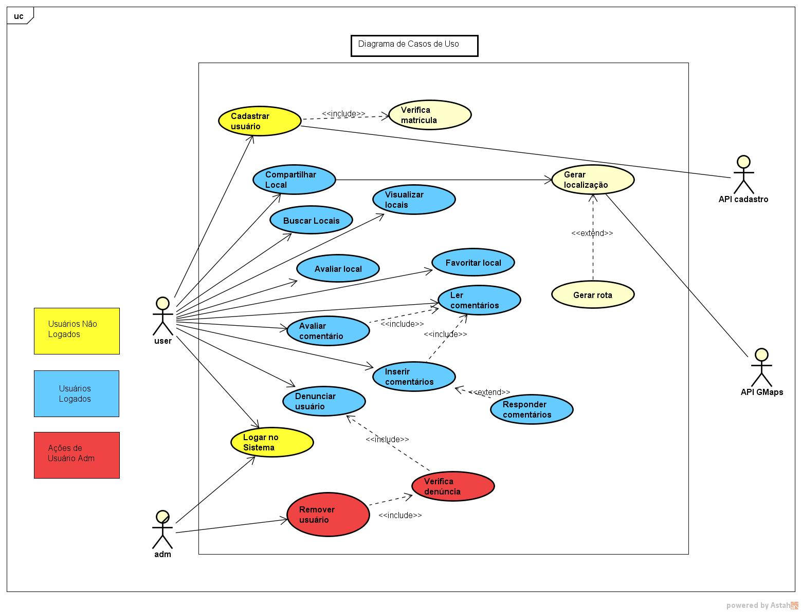
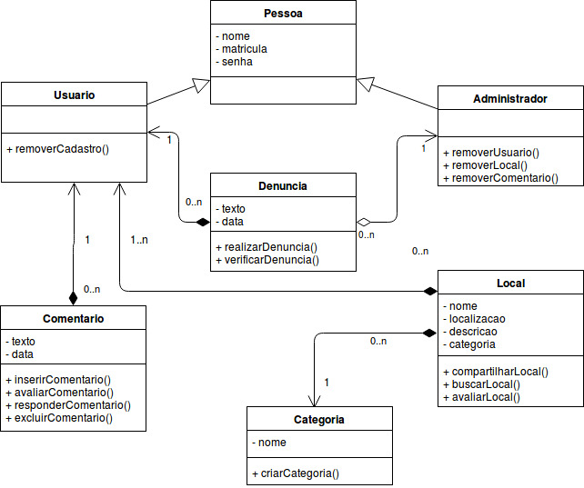

# Documento de Arquitetura

## Histórico de Revisão

| Data | Versão | Descrição | Autores |
| ---  |  ---   |  ---  |  ---  |
| 26/08/2018 | 0.0.1 | Abertura do documento, tópicos 1, 7, 9| Matheus Gomes |

1. [Introdução]()       
  1.1 [Finalidade]()            
  1.2 [Escopo]()   
  1.3 [Definições, Acrônimos e Abreviações]()   

2. [Representação da Arquitetura]()

3. [Metas e Restrições de Arquitetura]()  
  3.1 [Ambiente e Ferramentas de Desenvolvimento]()

4. [Visão de Casos de Uso]()  
  4.1 [Realização de Casos de Uso]()
5. [Visão Lógica]()              

6. [Visão de Processos]()

7. [Visão de Implantação]()

8. [Visão de Implementação]()  
    8.1 [Visão Geral]()  
    8.2 [Camadas]()         
    8.2.1 [Model]()  
    8.2.2 [View]()  
    8.2.3 [Controller]()             

9. [Tamanho e Desempenho]()

10.  [Qualidade]()

11. [Referências]()

## 1:   Introdução

### 1.1 Finalidade

Este documento tem como objetivo fornecer uma visão geral da arquitetura que será usada no desenvolvimento do projeto e permitir um maior entendimento do módulo RecomendaFGA, para o aplicativo FGA app, e de como ele irá se comportar e se comunicar com as outras aplicações que compõem o projeto. Ele deve mostrar de forma clara e objetiva as decisões arquiteturais que foram tomadas em relação ao projeto.

### 1.2 Escopo

O RecomendaFGA será um módulo do aplicativo FGA app, este módulo será responsável pela recomendação de lugares próximos a Faculda do Gama, como também avaliar esse lugares por meio de notas. O documento apresentará toda a parte arquitetural para a confecção do software Dr. Down, a fim de tornar claras as características arquiteturais do projeto.

### 1.3 Definições, Acrônimos e Abreviações
* MVC ( Model View Controller) : Arquitetura de software utilizada em sistemas que desejam separar a modelagem de dados, interface e processamento de requisições em camadas independentes.

* iOS - Sistema operacional móvel da Apple Inc.

## 2: Representação Arquitetural
  O padrão de arquitetura será o MVC que separa a interação entre software e usuário. Existira uma integração entre duas tecnologias, Ruby on Rails 5.2.0 e React Native 2.0.1

### 2.1 Ruby on Rails 5.2.0
  Ruby on Rails é um framework de desenvolvimento de aplicações web escrito na linguagem de programação Ruby. Não apenas para desenvolvimento de aplicações web com Rails é possível construir web APIs. O Rails fará o papel de *Model-Controller*, resgatando informações do banco de dados da aplicação. Uma vez que esses dados são resgatados a *Controller* irá retornar os dados ao frontend, atendendo a requisição do usuário.

### 2.2 React Native
  O React Native é um módulo do React que por sua vez é uma biblioteca do JavaScript. Ele fornece suporte ao desenvolvimento de aplicações móveis usando JavaScript, CSS e HTML5. Com React Native é possivel criar aplicativos tanto para Android quanto para iOS de forma nativa, ou seja como se fossem escritos para uma plataforma específica. O camada *View* será representada pelo React Native, portanto será responsável por exibir a interface do usuário e fazer requisições a API feita em Ruby on Rails.

## 3:  Requisitos e Restrições Arquiteturais

## 4: Visão de Casos de Uso

### 4.1 Realização de Casos de Uso
  | Ator | Descrição |
  | --- | --- |
  | Usuário Comum | Usuário que somente pode utilizar as funcionalidades padrão do aplicativo|
  | Usuário Administrador | Usuário com acesso integral ao Sistema com prioridades sobre o usuário comum |
  | API Cadastro | API que irá fazer a validação de login do usuário |
  | API Google Maps | API usada para fornecer a localização global do local cadastrado |
  

### 4.2 Descrição dos Casos de Uso
  | Caso de Uso | Descrição |
  | --- | --- |
  | UC01: Compartilhar local | Compartilhamento de local baseado na posição do usuário |
  | UC02: Buscar locais | Fazer busca dos locais já cadastrados no sistema |
  | UC03: Visualizar local | Visualizar local e todas as informações referentes a ele |
  | UC04: Favoritar local | Salvar local em uma lista de favoritos |
  | UC05: Avaliar local | Fazer avaliação do local através de um sistema de notas |
  | UC06: Inserir comentários | Adicionar um novo comentário em determinada publicação |
  | UC07: Ler comentários | Ler comentários realizados por outros usuários |
  | UC08: Responder comentários | Responder comentários realizados por outros usuários |
  | UC09: Avaliar comentário | Fazer avaliação do comentário através de um sistema de curtida |
  | UC10: Denunciar usuário | Fazer denúncia de usuário que realizar qualquer publicação ou comentário indevido |
  | UC11: Realizar login | Fazer login no aplicativo podendo assim fazer uso das demais funcionalidades disponibilizadas |

## 5:   Visão Lógica
  A visão lógica da aplicação é composta por dois pacotes principais: API e React Native.

  A API é responsável por lidar com comunicação e acesso ao banco de dados, de forma geral é responsável por automatizar o acesso e modificações necessárias aos dados. Na API existe tambem uma camada *Controller* que é responsável por lidar com as requisições e tambem o envio de dados a *View*, aqui representada pelo React Native.

  O React Native é um módulo do React que por sua vez é uma biblioteca do JavaScript. Ele assim como o React utiliza dados os quais podem ser atualizados sem a necessidade de atualizar a página. No sistema ele é responsável pela interação com o usuário através da criação de interfaces. Essas interfaces são nativas, ou seja com elementos próprios de cada sistema operacional, criando assim um ambientes mais compativeis.

### 5.1 Diagrama de Classes

## 6:   Visão de Processo

## 7:   Visão de Implantação

## 8:    Visão de Implementação

### 8.1 Visão Geral

A arquitetura utilizada na aplicação é o padrão arquitetural MVC, que é adotada framework Ruby on Rails.

### 8.2 Camadas

#### 8.2.1 Models
É nessa camada que se implementa as classes que serão responsáveis por definir as informações que estarão presentes na tabela de dados (banco de dados) e como esses dados serão acessados , validados , relacionados e etc. Isto é, a model é responsável por conter todas as informações referentes à manipulação de dados.

#### 8.2.2 Views
A camada view é a responsável por formatar as informações e apresentá-las ao usuário de forma organizada.

#### 8.2.3 Controller
É camada controller que fica responsável pelo fluxo do usuário na aplicação. Esta é usada para comunicação com a Model e renderização das Views, com informações procedentes da Model.

## 9.  Tamanho e Desempenho

## 10. Qualidade

A arquitetura utilizada permite definir algumas metas de qualidade, como facilidade no acrescimo de novas funcionalidades, na manutenção e reaproveitamento de código. Por ser uma arquitetura bastante utilizada aumenta a confiabilidade no software e, em caso de problemas, o suporte é maior e de mais fácil acesso.

## 11.  Referências

ARTEFATO: DOCUMENTO DE ARQUITETURA DE SOFTWARE. FUNPAR. Disponível em: <http://www.funpar.ufpr.br:8080/rup/process/artifact/ar_sadoc.htm>. Acesso em: 26 Agosto 2018.

 Rails Framework. UNIVEM. Disponível em:
<https://www.univem.edu.br/compsi/semanati2009/rails.pdf>. Acesso em: 26 Agosto 2018.

TEMPLATE Documento de Arquitetura de Software. Disponível em:
<https://github.com/DroidFoundry/DroidMetronome/wiki/TEMPLATE-Documento-de-Arquitetura-de-Software>. Acesso em: 26 Agosto 2018.
