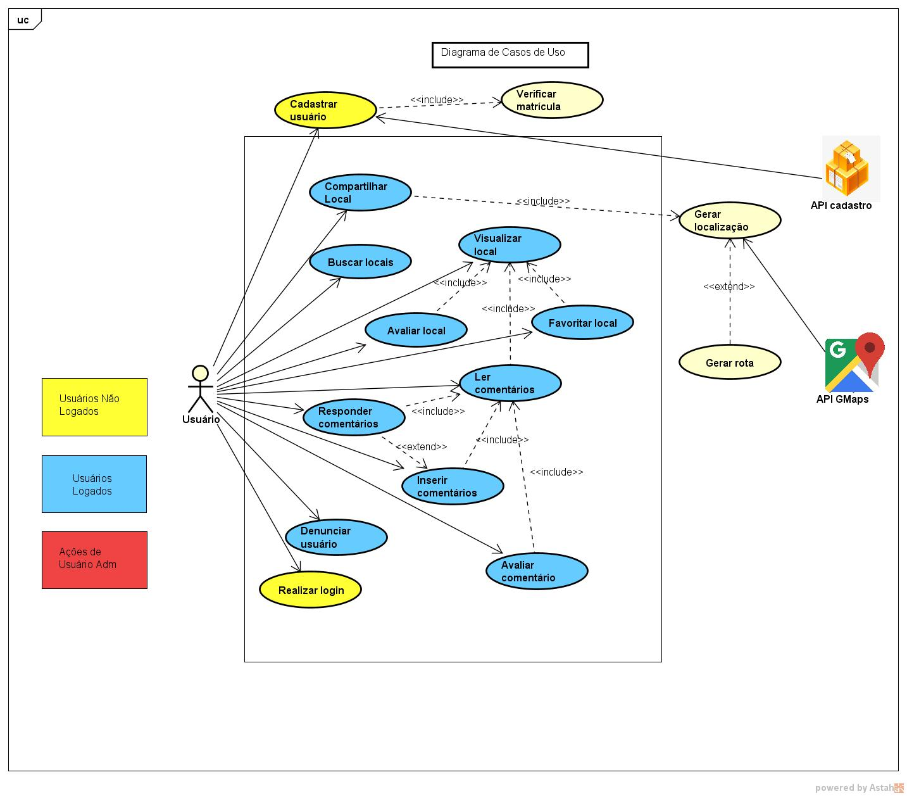
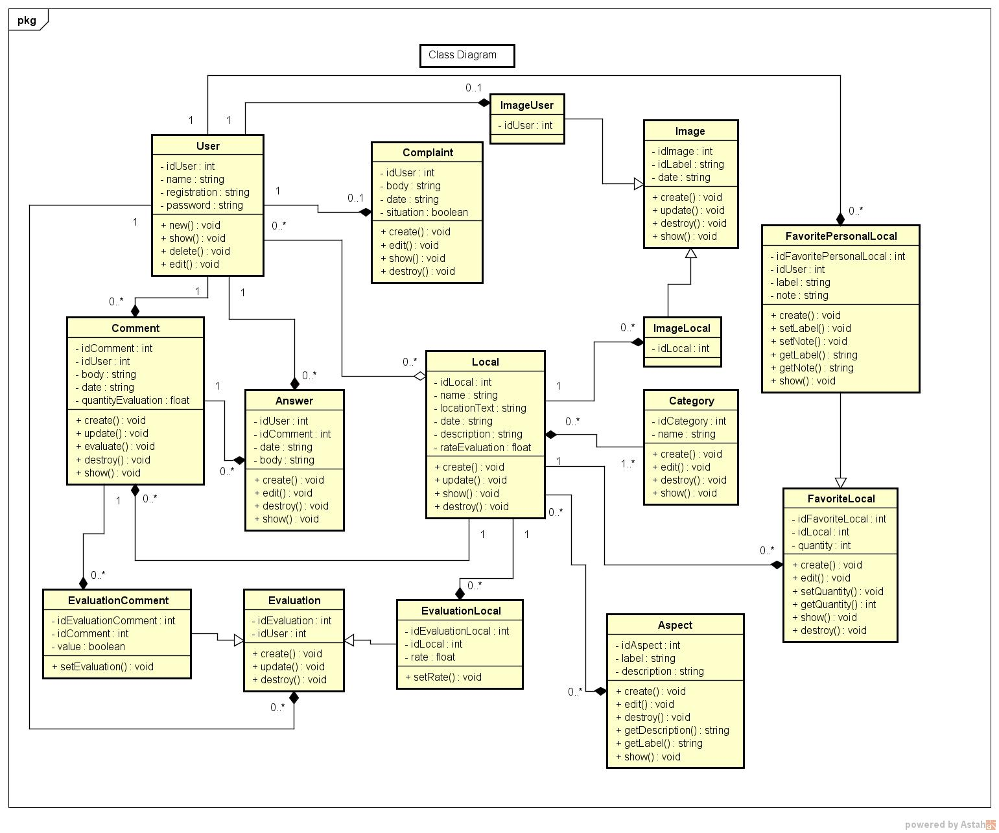

# Documento de Arquitetura

## Sumário

1. [Introdução](https://github.com/fga-eps-mds/RecomendaFGA/blob/documento_arquiterura/docs/_posts/2018-08-28-architecture-doc.md#1---introdu%C3%A7%C3%A3o)       
  1.1 [Finalidade](https://github.com/fga-eps-mds/RecomendaFGA/blob/documento_arquiterura/docs/_posts/2018-08-28-architecture-doc.md#11-finalidade)            
  1.2 [Escopo](https://github.com/fga-eps-mds/RecomendaFGA/blob/documento_arquiterura/docs/_posts/2018-08-28-architecture-doc.md#12-escopo)   
  1.3 [Definições, Acrônimos e Abreviações](https://github.com/fga-eps-mds/RecomendaFGA/blob/documento_arquiterura/docs/_posts/2018-08-28-architecture-doc.md#13-defini%C3%A7%C3%B5es-acr%C3%B4nimos-e-abrevia%C3%A7%C3%B5es)   

2. [Representação da Arquitetura](https://github.com/fga-eps-mds/RecomendaFGA/blob/documento_arquiterura/docs/_posts/2018-08-28-architecture-doc.md#2-representa%C3%A7%C3%A3o-arquitetural)   
  2.1 [Ruby on Rails 5.2.0](https://github.com/fga-eps-mds/RecomendaFGA/blob/documento_arquiterura/docs/_posts/2018-08-28-architecture-doc.md#21-ruby-on-rails-520)  
  2.2 [React Native](https://github.com/fga-eps-mds/RecomendaFGA/blob/documento_arquiterura/docs/_posts/2018-08-28-architecture-doc.md#22-react-native)    

3. [Metas e Restrições de Arquitetura](https://github.com/fga-eps-mds/RecomendaFGA/blob/documento_arquiterura/docs/_posts/2018-08-28-architecture-doc.md#21-ruby-on-rails-520)  

4. [Visão de Casos de Uso](https://github.com/fga-eps-mds/RecomendaFGA/blob/documento_arquiterura/docs/_posts/2018-08-28-architecture-doc.md#4-vis%C3%A3o-de-casos-de-uso)  
  4.1 [Realização de Casos de Uso](https://github.com/fga-eps-mds/RecomendaFGA/blob/documento_arquiterura/docs/_posts/2018-08-28-architecture-doc.md#41-realiza%C3%A7%C3%A3o-de-casos-de-uso)   
  4.2 [Descrição dos Casos de Uso](https://github.com/fga-eps-mds/RecomendaFGA/blob/documento_arquiterura/docs/_posts/2018-08-28-architecture-doc.md#42-descri%C3%A7%C3%A3o-dos-casos-de-uso)

5. [Visão Lógica](https://github.com/fga-eps-mds/RecomendaFGA/blob/documento_arquiterura/docs/_posts/2018-08-28-architecture-doc.md#5---vis%C3%A3o-l%C3%B3gica)  
  5.1 [Diagrama de Classes](https://github.com/fga-eps-mds/RecomendaFGA/blob/documento_arquiterura/docs/_posts/2018-08-28-architecture-doc.md#51-diagrama-de-classes)

6. [Visão de Implementação](https://github.com/fga-eps-mds/RecomendaFGA/blob/documento_arquiterura/docs/_posts/2018-08-28-architecture-doc.md#6--vis%C3%A3o-de-implementa%C3%A7%C3%A3o)  
    6.1 [Visão Geral](https://github.com/fga-eps-mds/RecomendaFGA/blob/documento_arquiterura/docs/_posts/2018-08-28-architecture-doc.md#61-vis%C3%A3o-geral)  
    6.2 [Camadas](https://github.com/fga-eps-mds/RecomendaFGA/blob/documento_arquiterura/docs/_posts/2018-08-28-architecture-doc.md#62-camadas)         
    6.2.1 [Model](https://github.com/fga-eps-mds/RecomendaFGA/blob/documento_arquiterura/docs/_posts/2018-08-28-architecture-doc.md#621-models)  
    6.2.2 [View](https://github.com/fga-eps-mds/RecomendaFGA/blob/documento_arquiterura/docs/_posts/2018-08-28-architecture-doc.md#622-views)  
    6.2.3 [Controller](https://github.com/fga-eps-mds/RecomendaFGA/blob/documento_arquiterura/docs/_posts/2018-08-28-architecture-doc.md#623-controller)             

7. [Tamanho e Desempenho](https://github.com/fga-eps-mds/RecomendaFGA/blob/documento_arquiterura/docs/_posts/2018-08-28-architecture-doc.md#7--tamanho-e-desempenho)

8. [Qualidade](https://github.com/fga-eps-mds/RecomendaFGA/blob/documento_arquiterura/docs/_posts/2018-08-28-architecture-doc.md#8-qualidade)

9. [Referências](https://github.com/fga-eps-mds/RecomendaFGA/blob/documento_arquiterura/docs/_posts/2018-08-28-architecture-doc.md#9--refer%C3%AAncias)

## 1:   Introdução

### 1.1 Finalidade

Este documento tem como objetivo fornecer uma visão geral da arquitetura que será usada no desenvolvimento do projeto e permitir um maior entendimento do módulo IndicaAi, para o aplicativo FGA app, e de como ele irá se comportar e se comunicar com as outras aplicações que compõem o projeto. Ele deve mostrar de forma clara e objetiva as decisões arquiteturais que foram tomadas em relação ao projeto.

### 1.2 Escopo

O IndicaAi será um módulo do aplicativo FGA app, este módulo será responsável pela recomendação de lugares próximos a Faculda do Gama, como também avaliar esses lugares por meio de notas. O documento apresentará toda a parte arquitetural para a confecção do IndicaAi, a fim de tornar claras as características arquiteturais do projeto.

### 1.3 Definições, Acrônimos e Abreviações
* MVC ( Model View Controller) : Arquitetura de software utilizada em sistemas que desejam separar a modelagem de dados, interface e processamento de requisições em camadas independentes.

* iOS - Sistema operacional móvel da Apple Inc.

## 2: Representação Arquitetural
  O padrão de arquitetura será o MVC que separa a interação entre software e usuário. Existira uma integração entre duas tecnologias, Ruby on Rails 5.2.1 e React Native 2.0.1, consistindo em um modelo cliente-servidor, no qual há uma API criada em Ruby on Rails, responsável por fornecer dados ao frontend criado com React Native. A interface do usuário (frontend), será compartilhada com várias API's funcionando sobre o modelo arquitetural de microserviços.

### 2.1 Ruby on Rails 5.2.1
  Ruby on Rails é um framework de desenvolvimento de aplicações web escrito na linguagem de programação Ruby. Não apenas para desenvolvimento de aplicações web com Rails é possível construir web APIs. O Rails fará o papel de *Model-Controller*, resgatando informações do banco de dados da aplicação. Uma vez que esses dados são resgatados a *Controller* irá retornar os dados ao frontend, atendendo a requisição do usuário.

### 2.2 React Native

  O React Native é um framework de JavaScript que fornece suporte ao desenvolvimento de aplicações móveis usando JavaScript, CSS e HTML5. Com React Native é possivel criar aplicativos tanto para Android quanto para iOS de forma nativa, ou seja como se fossem escritos para uma plataforma específica. A camada *View* será representada pelo React Native, portanto será responsável por exibir a interface do usuário e fazer requisições a API feita em Ruby on Rails.

## 3: Requisitos e Restrições Arquiteturais

   * A aplicação deve ser contruída sobre a arquitetura de microserviços, na qual o frontend será desenvolvido em React Native.

   * O Aplicativo será funcional em dispositivos celulares Android ou iOS os quais devem ter acesso a internet.

   * O frontend deve ser desenvolvido para consumir diferentes serviços de APIs diferentes, portanto um modulo não pode interferir no outro.

   * O serviço de autenticação de usuários será fornecido por uma API externa.

## 4: Visão de Casos de Uso

### 4.1 Realização de Casos de Uso
  | Ator | Descrição |
  | --- | --- |
  | Usuário Comum | Usuário que somente pode utilizar as funcionalidades padrão do aplicativo|
  | API de Usuários | API que irá fazer a validação de login do usuário |
  | API Google Maps | API usada para fornecer a localização global do local cadastrado |  

  

### 4.2 Descrição dos Casos de Uso
  | Caso de Uso | Descrição |
  | --- | --- |
  | UC01: Cadastrar local | Cadastramento de um local pelo usuário |
  | UC02: Gerar localização | Gera a localização no mapa de acordo com a posição do usuário ou por um ponto de escolha|
  | UC03: Gerar rota | Cria uma rota baseada na posição de partida do usuário e a posição de destino do local |
  | UC04: Solicitar Rota | Solicitação para gerar uma rota entre o usuário e o destino |
  | UC05: Buscar locais | Fazer busca dos locais já cadastrados no sistema |
  | UC06: Visualizar local | Visualizar local e todas as informações referentes a ele |
  | UC07: Favoritar local | Salvar local em uma lista de favoritos |
  | UC08: Avaliar local | Fazer avaliação do local através de um sistema de notas |
  | UC09: Inserir comentários | Adicionar um novo comentário em determinada publicação |
  | UC10: Ler comentários | Ler comentários realizados por outros usuários |
  | UC11: Responder comentários | Responder comentários realizados por outros usuários |
  | UC12: Avaliar comentário | Fazer avaliação do comentário através de um sistema de curtidas |
  | UC13: Realizar login | Fazer login no aplicativo podendo assim fazer uso das demais funcionalidades disponibilizadas |

## 5:   Visão Lógica

  A visão lógica da aplicação é composta por dois pacotes principais: API e Frontend.

  

  * Banco de dados -  Será utilizado o banco de dados PostgreSQL, que é objeto relacional. O banco será responsável por guardar as tabelas de dados criadas pelas *Models* da API.

  * Model - No Rails a model é responsável por implementar as classes que serão responsáveis por definir as informações que estarão presentes na tabela de dado, isso é feito pela herança da classe Active Record a qual faz ORM (Object Relational Mapping), abstraindo assim a necessidade de se conhecer a linguagem SQL pois a Active Record faz todo o trabalho de persistência. O recurso de ORM da *Model* do Rails está em conformidade com o banco de dados PostgreSQL que é objeto relacional.

  * Controller - Responsável pelo fluxo do usuário na aplicação ela controla as requisições feitas pelo Frontend. Controllers sarão responsáveis também pela serialização dos dados, pois a comunicação Frontend/Backend será feita por métodos HTTP (GET, PUT, POST, DELETE entre outros) e JSON (JavaScript Obejct Notation), o que está em conformidade com o Frontend em React Native que é um framework de JavaScript que interpreta JSON e faz requisições HTTP.  

  * React Native assim como o React utiliza dados os quais podem ser atualizados sem a necessidade de atualizar a página. No sistema ele é responsável pela interação com o usuário através da criação de interfaces. Essas interfaces são nativas, ou seja com elementos próprios de cada sistema operacional, criando assim ambientes mais compativeis.

### 5.1 Diagrama de Classes

## 6:  Visão de Implementação

### 6.1 Visão Geral

A arquitetura utilizada na aplicação é o padrão arquitetural MVC, que é adotada framework Ruby on Rails.

### 6.2 Camadas

#### 6.2.1 Models
É nessa camada que se implementa as classes que serão responsáveis por definir as informações que estarão presentes na tabela de dados (banco de dados) e como esses dados serão acessados , validados , relacionados e etc. Isto é, a model é responsável por conter todas as informações referentes à manipulação de dados.

#### 6.2.2 Views
A camada view é a responsável por formatar as informações e apresentá-las ao usuário de forma organizada.

#### 6.2.3 Controller
É camada controller que fica responsável pelo fluxo do usuário na aplicação. Esta é usada para comunicação com a Model e renderização das Views, com informações procedentes da Model.

## 7.  Tamanho e Desempenho

Como o sistema é um aplicativo para sistemas mobile em que os principais obejtivos são o cadastro e compartilhamento de locais próximos a universidade tem portanto como usuário principal o corpo acadêmico da FGA. É esperado que o software seja utilizado por toda a comunidade academica por apresentar vantagens a todos que fazem parte da mesma, com isso é previsto um número próximo a 2300 usuários, o que implica que caso seja utilizado um serviço de Cloud Server, plataformas mais simples como Heroku poderam ser usadas durante o tempo de adesão do aplicativo, porem quando em pleno funcionamento uma plataforma mais robusta como AWS (Amazon Web Services) afim de atender melhor o número de acessos simultâneos.

A arquitetura foi escolhida de forma que o aplicativo tenha um aparato de armazenamento, busca, navegação, e visualização de locais suficientemente eficientes para que atenda de forma satisfatória até dispositivos celulares com hardwares menos poderosos. Vale destacar também que a velocidade de conexão do usuário com a internet e a disponibilidade do servidor possuem grande impacto sobre a experiencia com o aplicativo.

## 8. Qualidade

A arquitetura de microserviços permite definir algumas metas de qualidade, como facilidade no acrescimo de novas funcionalidades, na manutenção e reaproveitamento de código. Por não ser um arquitetura monolítica ela permite uma maior escalabilidade, como cada serviço é um componente separado é possível expandir um único módulo sem ter que dimensionar todo o sistema, alem de facilitar a depuração, por possuir modulos menores, permitindo assim um processo contínuo de teste e entrega.

O React Native está em conformidade com os requisitos por permitir a arquitetura de microserviços, alem de criar aplicativos nativos, diminuindo assim a chances de problemas relacionados a compatibilidades em diversas plataformas. Outro fator é o alto suporte da comunidade, criando assim um ambiente onde quaisquer falhas podem ser resolvidas em menor tempo.

 A escolha de fazer uma API é justificada pelo poder de integração e customização dos serviços. Através da integração com outras APIs é possível obter informações sobre o usuário sem que ele tenha preenchido nenhum formulário, fato que se encaixa bem com o contexto do projeto que é uma integração de vários módulos, podendo no futuro haver troca de dados entre as APIs de cada modulo para oferecer um serviço mais personalizado para o usuário.

 Por fim a escolha do conjunto Rails API + React Native + microserviços, é justificada pela capacidade de acrescimo de novas funcionalidades, manutenção e reaproveitamento de código, os quais juntos aumentam significativamente a qualidade do sistema.

## 9.  Referências

ARTEFATO: DOCUMENTO DE ARQUITETURA DE SOFTWARE. FUNPAR. Disponível em: <http://www.funpar.ufpr.br:8080/rup/process/artifact/ar_sadoc.htm>. Acesso em: 26 Agosto 2018.

 Rails Framework. UNIVEM. Disponível em:
<https://www.univem.edu.br/compsi/semanati2009/rails.pdf>. Acesso em: 26 Agosto 2018.

TEMPLATE Documento de Arquitetura de Software. Disponível em:
<https://github.com/DroidFoundry/DroidMetronome/wiki/TEMPLATE-Documento-de-Arquitetura-de-Software>. Acesso em: 26 Agosto 2018.

Especificação suplementar. Disponível em:
<https://github.com/Instagram-Requisitos-2018-1/Instagram/wiki/Especifica%C3%A7%C3%A3o-suplementar>. Acesso em: 30 Agosto 2018.

Anuário Estatístico da UnB 2017. Disponível em:
<http://www.dpo.unb.br/index.php?option=com_phocadownload&view=category&download=167:unbemnureros-12&id=57:folder-unb-em-numeros>. Acesso em: 3 Setembro 2018.
